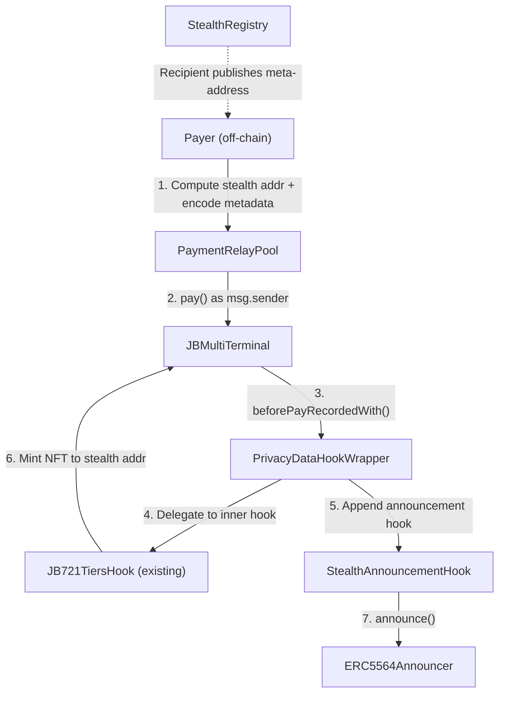

# Nana Privacy V6

Standalone privacy contracts for Juicebox V6 — hiding payer identity, recipient identity, and payment amounts using EIP-5564 stealth addresses, a payment relay pool, and 721 tier denominations. No changes to existing contracts.

For full documentation, see [docs.juicebox.money](https://docs.juicebox.money/). If you have questions, reach out on [Discord](https://discord.com/invite/ErQYmth4dS).

_If you're having trouble understanding these contracts, take a look at the [core protocol contracts](https://github.com/Bananapus/nana-core-v6) and the [721 hook contracts](https://github.com/Bananapus/nana-721-hook-v6) first._

## Conceptual Overview

Full transactional privacy for Juicebox V6 uses three independent layers composed together:

| Privacy dimension | Mechanism | New code |
|---|---|---|
| Payer identity | `PaymentRelayPool` (intermediary caller) | ~60 lines |
| Recipient identity | EIP-5564 stealth addresses | ~70 lines (registry + announcer) |
| Payment amount | 721 tier prices as fixed denominations | Configuration pattern only |

The core insight: NFT tiers already enforce fixed prices per tier. Every Tier 2 mint costs exactly the same amount. This is a fixed-denomination deposit pool — the same primitive Tornado Cash uses — but the "deposit receipt" is an NFT instead of a cryptographic note. Combined with stealth addresses for recipient privacy and relayers for payer privacy, this provides full privacy without ZK circuits, commitment pools, or core protocol changes.

Each layer is independent. Use one, two, or all three. Privacy is per-payment opt-in — the payer chooses privacy or not via metadata flags and address choices.

## Architecture



### Deployer Compatibility

| Deployment path | Announcement mechanism | Changes required |
|---|---|---|
| Direct core (JBController + JBMultiTerminal) | `PrivacyDataHookWrapper` wraps 721 hook as `metadata.dataHook` | None to core |
| JBOmnichainDeployer | `PrivacyDataHookWrapper(innerHook=address(0))` as extra data hook | None to deployer |
| REVDeployer (revnets) | `PaymentRelayPool` emits announcement directly | None to REVDeployer |
| Any path, no relay | Client calls `ERC5564Announcer.announce()` separately | None |

### Contracts

| Contract | Description |
|----------|-------------|
| [`IERC5564Announcer`](src/interfaces/IERC5564Announcer.sol) | EIP-5564 stealth address announcement interface. Defines the `Announcement` event and `announce()` function. |
| [`IStealthRegistry`](src/interfaces/IStealthRegistry.sol) | Registry interface for EIP-5564 stealth meta-addresses. Accounts register their own meta-addresses; payers look them up to compute stealth addresses off-chain. |
| [`ERC5564Announcer`](src/ERC5564Announcer.sol) | Singleton contract that emits `Announcement` events. Stateless — anyone can call `announce()`. Deployed once per chain. |
| [`StealthRegistry`](src/StealthRegistry.sol) | Stores stealth meta-addresses by account and scheme. Accounts register their `(spendingPubKey, viewingPubKey)` pair so payers can compute stealth addresses via ECDH. |
| [`StealthAnnouncementHook`](src/StealthAnnouncementHook.sol) | `IJBPayHook` that extracts stealth metadata from payer metadata via `JBMetadataResolver` and emits an EIP-5564 announcement. Receives no funds — called purely for the event. |
| [`PrivacyDataHookWrapper`](src/PrivacyDataHookWrapper.sol) | `IJBRulesetDataHook` wrapper. Delegates to an optional inner hook (typically `JB721TiersHook`) and appends `StealthAnnouncementHook` to pay hook specs when stealth metadata is present. Transparent for non-privacy payments. Two modes: wrapping a 721 hook (core direct) or standalone (omnichain extra hook). |
| [`PaymentRelayPool`](src/PaymentRelayPool.sol) | Forwards payments to any `IJBTerminal`, hiding the real payer's address. The terminal sees `msg.sender = PaymentRelayPool` for all users. Also supports atomic announcement via `relayPaymentWithAnnouncement()` — the recommended entry point for revnets. |

## How It Works

### Private Payment Flow

1. **Payer** looks up the recipient's stealth meta-address from `StealthRegistry`
2. **Payer** computes a stealth address + ephemeral keypair via ECDH (EIP-5564, off-chain)
3. **Payer** selects privacy tier(s) matching the desired contribution (e.g., 3 x Tier 3 = 3 ETH)
4. **Payer** encodes tier IDs + stealth metadata in the payment metadata
5. **Payer** calls `PaymentRelayPool.relayPayment()` — the relay pool becomes `msg.sender`
6. **Terminal** records the payment. `Pay` event shows `payer = RelayPool` (real payer hidden)
7. **PrivacyDataHookWrapper** detects stealth metadata, appends `StealthAnnouncementHook` to hook specs
8. **721 hook** mints NFT(s) to the stealth address
9. **StealthAnnouncementHook** emits `Announcement` event with the ephemeral public key
10. **Recipient** scans `Announcement` events with their viewing key, finds matches, derives stealth private keys

### What an On-Chain Observer Sees

- `Pay` event: `payer=RelayPool, beneficiary=0x7f3a..stealth, amount=1 ETH`
- `Mint` event: `tokenId=42, tierId=3, beneficiary=0x7f3a..stealth`
- `Announcement` event: `stealthAddress=0x7f3a.., ephemeralPubKey=0xab12..`

The observer knows "a relayer paid 1 ETH and some address got a Tier 3 NFT." They cannot determine who the real payer is, who the real recipient is, or distinguish this payment from any other Tier 3 mint.

### Privacy Tier Design Pattern

Privacy tiers use fixed denominations with logarithmic spacing. No new contracts — this is a configuration pattern:

| Tier ID | Price | Purpose |
|---|---|---|
| 1 | 0.01 ETH | Micro contributions |
| 2 | 0.1 ETH | Small contributions |
| 3 | 1 ETH | Medium contributions |
| 4 | 10 ETH | Large contributions |
| 5 | 100 ETH | Whale contributions |

Key configuration:
- **Unlimited supply** (`type(uint32).max`) — larger anonymity set
- **No discounts** — would break denomination uniformity
- **No reserves** — reserve mints to known addresses leak information
- **`preventOverspending = true`** — enforces exact tier price matching
- **`weight = 0`** in ruleset — prevents fungible token issuance (NFT is the receipt)

### Metadata Encoding

Stealth metadata is encoded in payer metadata using `JBMetadataResolver`:

```solidity
// Compute the metadata ID (all contracts must agree on the same metadataIdTarget).
bytes4 stealthId = JBMetadataResolver.getId("stealth", metadataIdTarget);

// Encode the stealth payload.
bytes memory stealthPayload = abi.encode(schemeId, ephemeralPubKey, viewTag);

// Pack into JBMetadataResolver format alongside tier IDs.
bytes memory metadata = JBMetadataResolver.createMetadata(ids, datas);
```

### Private Cash Out Flow

Cash outs use ERC2771 meta-transactions (already supported by `JBMultiTerminal`). The stealth address holder signs a meta-tx, a trusted forwarder relays it, and `_msgSender()` extracts the stealth address for permission checks. The reclaim is sent to a fresh address. See the [design spec](docs/superpowers/specs/2026-03-28-privacy-juicebox-design.md) for details.

## Risks

### Anonymity Set Size

The anonymity set for a privacy tier equals the total number of mints of that tier. Early projects have small anonymity sets (weak privacy). The set grows cumulatively with adoption. Sharing privacy tier configurations across projects can bootstrap larger sets.

### Timing Correlation

The `PaymentRelayPool` is a pass-through — it immediately executes payments. An observer monitoring the pool could correlate deposit timing with payment timing. Production deployments should consider batching, delay capabilities, or multiple pool operators.

### Amount Correlation

Multi-tier mints in a single transaction reveal the total contribution (sum of tier prices). For maximum privacy, split large contributions across multiple transactions to different stealth addresses via different relayers.

### ERC-20 Limitation

The terminal pulls ERC-20 tokens from `_msgSender()` via Permit2. For the relay pool, this means tokens must be in the pool's balance before calling `relayPayment()`. Transferring ERC-20 tokens to the pool creates an on-chain trace. **Privacy payments should use native ETH.**

### Metadata Distinguishability

The `Pay` event metadata contains stealth data, making privacy payments distinguishable from regular payments. This reduces the effective anonymity set to privacy-mode payments only.

## Install

For `npm` projects (recommended):

```bash
npm install @bananapus/privacy-v6
```

For `forge` projects:

```bash
forge install Bananapus/nana-privacy-v6
```

## Develop

`nana-privacy-v6` uses the [Foundry](https://book.getfoundry.sh/) development toolchain for builds, tests, and deployments. To get set up:

```bash
npm ci && forge install
```

| Command | Description |
|---------|-------------|
| `forge build` | Compile the contracts and generate artifacts |
| `forge test` | Run the test suite |
| `forge fmt` | Lint and format Solidity files |
| `forge coverage` | Generate a test coverage report |
| `forge clean` | Remove build artifacts and cache |

## Repository Layout

```
nana-privacy-v6/
├── src/
│   ├── ERC5564Announcer.sol              # EIP-5564 announcement singleton
│   ├── StealthRegistry.sol               # Stealth meta-address storage
│   ├── StealthAnnouncementHook.sol       # IJBPayHook for announcements
│   ├── PrivacyDataHookWrapper.sol        # IJBRulesetDataHook wrapper
│   ├── PaymentRelayPool.sol              # Payer privacy relay
│   └── interfaces/
│       ├── IERC5564Announcer.sol         # Announcement interface
│       └── IStealthRegistry.sol          # Registry interface
├── test/
│   ├── ERC5564Announcer.t.sol            # Announcer unit tests
│   ├── StealthRegistry.t.sol             # Registry unit tests
│   ├── StealthAnnouncementHook.t.sol     # Hook unit tests
│   ├── PrivacyDataHookWrapper.t.sol      # Wrapper unit tests
│   ├── PaymentRelayPool.t.sol            # Relay pool unit tests
│   └── integration/
│       ├── PrivatePaymentCore.t.sol      # Core direct integration scaffold
│       ├── PrivatePaymentRevnet.t.sol    # Revnet integration scaffold
│       └── PrivatePaymentOmnichain.t.sol # Omnichain integration scaffold
├── script/
│   └── Deploy.s.sol                      # Deployment script
├── foundry.toml                          # Foundry configuration
├── package.json                          # NPM package configuration
└── remappings.txt                        # Forge remappings
```
